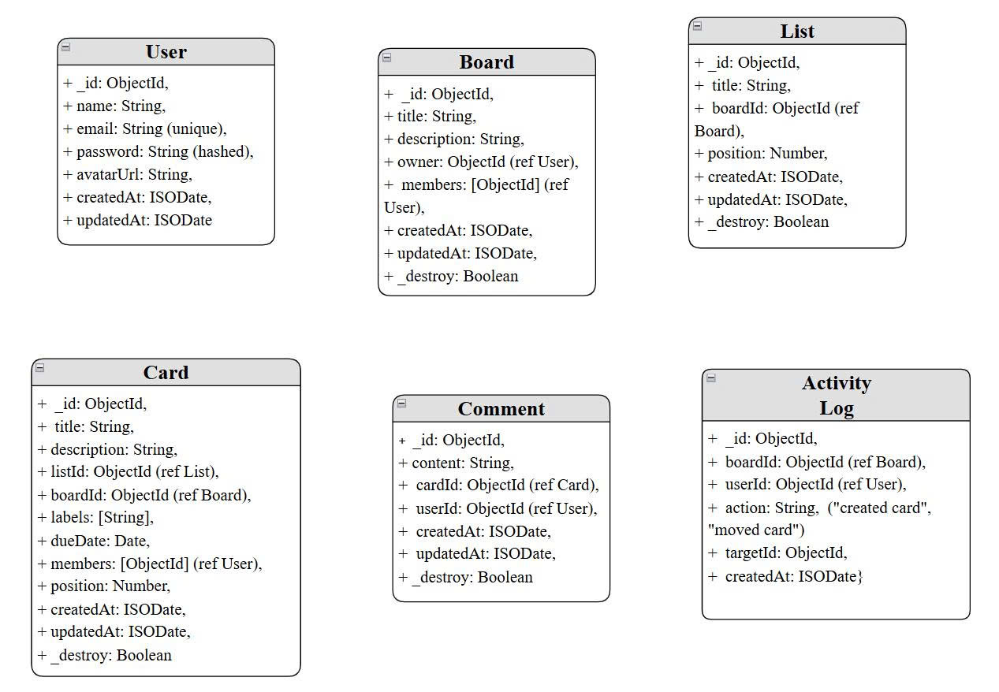

# ĐẶC TẢ KỸ THUẬT HỆ THỐNG QUẢN LÝ

## 1. Giới thiệu

**Mục tiêu:**  
 Cung cấp một ứng dụng web cho phép người dùng quản lý công việc theo mô hình **Kanban** tương tự **Trello** (Board → List → Card).

**Người dùng chính:**

- **Owner:** tạo board, quản lý thành viên.
- **Member:** tham gia board, thêm/sửa card, comment.

## 2.Kiến trúc hệ thống

| Thành phần         | Công nghệ sử dụng                      |
| ------------------ | -------------------------------------- |
| **Frontend**       | React + Vite + TailwindCSS + shadcn/ui |
| **Backend**        | Node.js + Express + TypeScript         |
| **Database**       | MongoDB (Mongoose ODM)                 |
| **Authentication** | JWT (JSON Web Token)                   |
| **Realtime**       | WebSocket / Socket.IO                  |
| **Triển khai**     | Docker                                 |

---

## 3. Use Cases chính

- Đăng ký / Đăng nhập (Auth)
- Tạo / Xem / Chỉnh sửa / Xóa Board
- Thêm List trong Board
- Thêm Card trong List
- Di chuyển List và Card (Drag & Drop)
- Quản lý chi tiết Card (label, deadline, member, comment)
- Tìm kiếm và lọc card

---

## 4. Database Schema

### 4.1. User

```js
User {
  _id: ObjectId,
  name: String,
  email: String (unique),
  password: String (hashed),
  avatarUrl: String,
  createdAt: ISODate,
  updatedAt: ISODate,
  _destroy: Boolean
}
```

### 4.2. Board

```js
Board {
  _id: ObjectId,
  title: String,
  description: String,
  owner: ObjectId (ref User),
  members: [ObjectId] (ref User),
  createdAt: ISODate,
  updatedAt: ISODate,
  _destroy: Boolean
}
```

### 4.3. List

```js
List {
  _id: ObjectId,
  title: String,
  boardId: ObjectId (ref Board),
  position: Number,
  createdAt: ISODate,
  updatedAt: ISODate,
  _destroy: Boolean
}
```

### 4.4. Card

```js
Card {
  _id: ObjectId,
  title: String,
  description: String,
  listId: ObjectId (ref List),
  boardId: ObjectId (ref Board),
  labels: [String],
  dueDate: Date,
  members: [ObjectId] (ref User),
  position: Number,
  createdAt: ISODate,
  updatedAt: ISODate,
  _destroy: Boolean
}
```

### 4.5. Comment

```js
Comment {
  _id: ObjectId,
  content: String,
  cardId: ObjectId (ref Card),
  userId: ObjectId (ref User),
  createdAt: ISODate,
  updatedAt: ISODate
}

```

### 4.6. Activity Log (tùy chọn)

```js
Activity {
  _id: ObjectId,
  boardId: ObjectId (ref Board),
  userId: ObjectId (ref User),
  action: String,
  targetId: ObjectId,
  createdAt: ISODate}
```




## 5. API Endpoints

### 5.1. Auth

- POST /auth/register → tạo user mới.
- POST /auth/login → đăng nhập, trả JWT.

### 5.2. Boards

- GET /boards → lấy danh sách board của user.
- POST /boards → tạo board.
- GET /boards/:id → lấy chi tiết board.
- PUT /boards/:id → update board.
- DELETE /boards/:id → xóa board.

### 5.3. Lists

- POST /lists → tạo list mới trong board.
- PUT /lists/:id → update list.
- DELETE /lists/:id → xóa list.
- PATCH /lists/:id/reorder → thay đổi vị trí list

### 5.4. Cards

- POST /cards → tạo card mới.
- GET /cards/:id → chi tiết card.
- PUT /cards/:id → update card.
- DELETE /cards/:id → xóa card.
- PATCH /cards/:id/move → di chuyển card sang list khác.

### 5.5. Comments

- POST /cards/:id/comments → thêm comment.
- GET /cards/:id/comments → lấy comment.
- DELETE /comments/:id → xóa comment.

## 6. User stories (mẫu)

### 6.1. Authentication (Đăng ký / Đăng nhập)

- **Đăng ký**
  Là một người dùng mới, tôi muốn đăng ký tài khoản bằng email & mật khẩu để có thể bắt đầu sử dụng hệ thống.
  **Acceptance Criteria:**
  Nhập đủ thông tin → tạo user thành công →.
  Email trùng lặp → báo lỗi.
- **Đăng nhập**
  Là một người dùng, tôi muốn đăng nhập bằng email & mật khẩu để truy cập vào các board của mình.
  **Acceptance Criteria:**
  Đăng nhập đúng → trả JWT token + thông tin user → màn hình chính
  Sai mật khẩu/email → báo lỗi

### 6.2. Board Management

- **Tạo board**
  Là một owner, tôi muốn tạo board mới để quản lý dự án hoặc công việc riêng.
  **Acceptance Criteria:**
  Nhập tên board → tạo thành công.
  Board hiển thị trong dashboard của tôi.
- **Xem board**
  Là một người dùng, tôi muốn xem danh sách các board mà tôi tham gia để chọn board cần làm việc.
- **Chỉnh sửa board**
  Là một owner, tôi muốn chỉnh sửa tên/description của board để cập nhật thông tin.
- **Xóa board**
  Là một owner, tôi muốn xóa board nếu dự án đã kết thúc.  
  **Acceptance Criteria:**
  Board bị xóa → tất cả list & card cũng bị xóa.

### 6.3 List Management

- **Tạo list**
  Là một thành viên, tôi muốn thêm list vào board để nhóm các card theo trạng thái (Ví dụ: To Do, Doing, Done).
- **Chỉnh sửa list**
  Là một thành viên, tôi muốn đổi tên list để phù hợp hơn với quy trình công việc.
- **Xóa list** Là một thành viên, tôi muốn xóa list khi không còn cần thiết.
- **Sắp xếp lại list**
  Là một thành viên, tôi muốn kéo thả list để thay đổi thứ tự hiển thị.

### 6.4. Card Management

- **Tạo card**
  Là một thành viên, tôi muốn thêm card trong list để ghi nhận task cụ thể.
- **Xem chi tiết card**
  Là một thành viên, tôi muốn mở card để xem thông tin chi tiết, deadline, labels và người được assign.
- **Chỉnh sửa card**
  Là một thành viên, tôi muốn cập nhật thông tin card để phản ánh tiến độ mới.
- **Xóa card**
  Là một thành viên, tôi muốn xóa card nếu task đã bị hủy.
- **Di chuyển card**
  Là một thành viên, tôi muốn kéo card sang list khác để thay đổi trạng thái công việc.

### 6.5. Card Details Features

- **Labels**
  Là một thành viên, tôi muốn gán nhãn màu cho card để phân loại task nhanh chóng.
- **Deadline**
  Là một thành viên, tôi muốn thêm deadline để quản lý thời hạn task.
- **Assign members**
  Là một thành viên, tôi muốn gán người phụ trách vào card để phân công trách nhiệm.
- **Comments**
  Là một thành viên, tôi muốn thêm bình luận để thảo luận với các thành viên khác trong card.

### 6.6. Search & Filter

- **Tìm kiếm card**
  Là một thành viên, tôi muốn tìm kiếm card theo từ khóa để nhanh chóng truy cập task.
- **Lọc card**
  Là một thành viên, tôi muốn lọc card theo label hoặc member để tập trung vào công việc liên quan.

### 6.7. Activity Log ( tuỳ chọn)

- Là một owner, tôi muốn có log hoạt động để theo dõi ai đã tạo, chỉnh sửa hoặc di chuyển card trong board.

## 7. Non-functional requirements

**Performance**

- Hệ thống đảm bảo thao tác drag & drop cập nhật dưới 300ms, giúp trải nghiệm mượt mà, không lag.
- Thời gian phản hồi API trung bình < 500ms cho mỗi yêu cầu.
- Sử dụng lazy loading và phân trang để tối ưu tốc độ hiển thị danh sách board, card.

**Security**

- Mật khẩu người dùng được mã hóa bằng bcrypt.
- Sử dụng JWT cho xác thực, thời hạn token 7 ngày.
- Kiểm tra quyền truy cập (authorization) ở từng endpoint:
- Chỉ owner được chỉnh sửa hoặc xóa board.
- Member chỉ có thể thao tác trong board được mời.

**Scalability**

- Hệ thống hỗ trợ tối thiểu số người dùng đồng thời nhất định.
- Cấu trúc backend được thiết kế module hóa, dễ mở rộng theo microservice.

**UI/UX**

- Thiết kế trực quan, dễ thao tác, có animation nhẹ khi drag & drop.
- Có Dark Mode / Light Mode tùy chọn.
- Hiển thị cảnh báo rõ ràng khi xóa hoặc cập nhật dữ liệu quan trọng.
